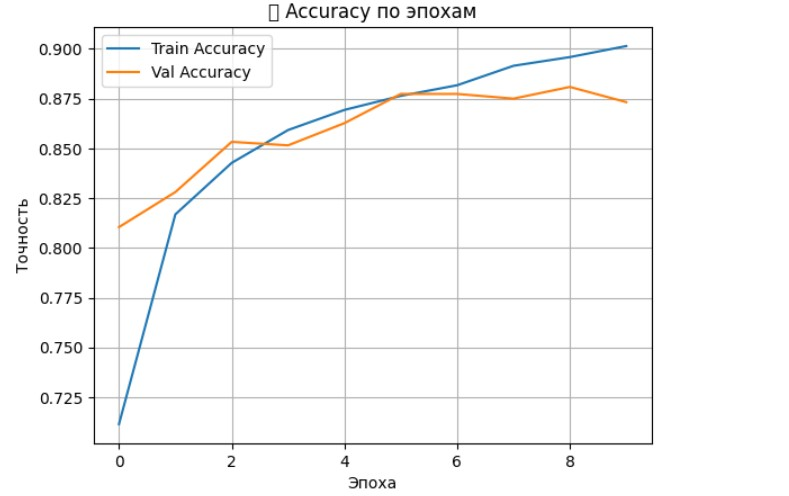
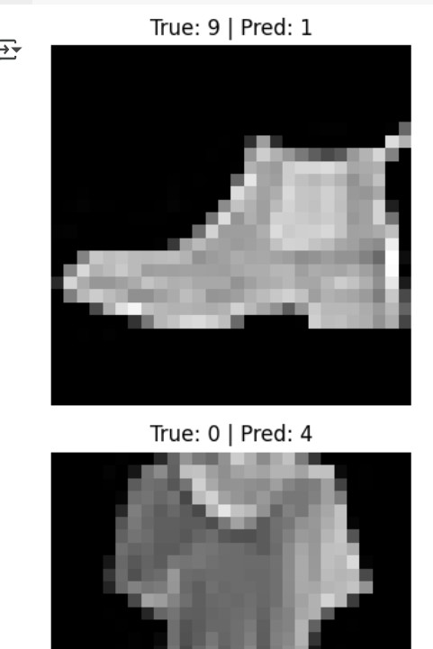

# 🧠 Классификация Fashion-MNIST с помощью CNN

Это решение реализует чистую и эффективную архитектуру **сверточной нейронной сети (CNN)** на датасете **Fashion-MNIST** с использованием **TensorFlow/Keras**.  
📌 **Цель** — классифицировать изображения одежды размером `28×28` пикселей в **10 категорий** (футболка, брюки, пуловер и др.).

---

## 🏗️ Архитектура модели

Модель построена из следующих слоев:

| Слой                     | Назначение                                          |
|--------------------------|-----------------------------------------------------|
| `Conv2D(32, 3x3)` + ReLU | Извлечение локальных признаков                     |
| `MaxPooling2D(2x2)`      | Снижение пространственного разрешения              |
| `Conv2D(64, 3x3)` + ReLU | Обучение более глубоких признаков                  |
| `MaxPooling2D(2x2)`      | Повторное снижение разрешения                      |
| `Flatten()`              | Преобразование тензора в вектор                    |
| `Dense(128)` + ReLU      | Обучение сложным зависимостям                      |
| `Dropout(0.3)`           | Регуляризация, предотвращающая переобучение        |
| `Dense(10, softmax)`     | Предсказание вероятностей по 10 классам одежды     |

---

## ⚙️ Параметры обучения

- **Функция потерь**: `sparse_categorical_crossentropy`  
- **Оптимизатор**: `Adam`  
- **Размер батча**: `64`  
- **Количество эпох**: `10`  
- **Доля валидации**: `10%` от обучающей выборки  

---

## 📊 Предобработка данных

✅ Применены следующие шаги:

- Заполнение пропущенных значений **медианой**  
- Нормализация пикселей до диапазона `[0, 1]`  
- Приведение входной формы изображений к `(28, 28, 1)`  
- **Аугментация** и **предобученные модели** не использовались  

---

## ✅ Результаты

📈 Модель показала:

- **Точность на валидации**: `~0.88`  
- Время обучения: **менее 5 минут** на GPU Kaggle  
- Стабильную работу без переобучения  
- Отличную базу для будущих улучшений:
  - Data Augmentation
  - Batch Normalization
  - Transfer Learning
  - Ensemble моделей

---

## 📁 Формат сабмита

Файл `submission.csv` должен содержать 2 колонки:

| Id  | label |
|-----|-------|
| 0   | 9     |
| 1   | 0     |
| 2   | 3     |
| ... | ...   |

📌 Где `label` — это предсказанный класс для изображения с индексом `Id`.

---

> 💡 *Этот базовый CNN-пайплайн является baseline для построения более мощных решений в задачах компьютерного зрения.*
